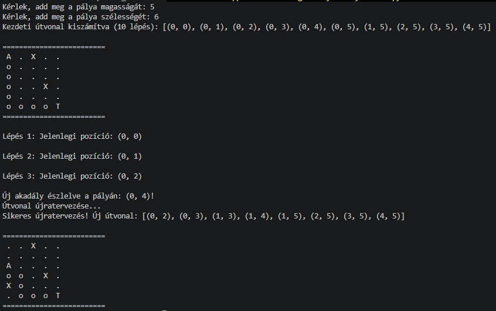

# Road_Planner
## Cél
A modul felelős a navigációért egy a felhasználó által megadott méretű rácshálóban. A rendszer dinamikusan kezeli az útvonaltervezést A* keresési algorithmussal, és valós időben reagál az észlelt új akadályokra.
## Architectúra

## Főbb komponensek
    -   Environment Model (map.py): Karbantartja a rácsot, kezeli az intervallum-ellenőrzéseket és tárolja az aktuális dinamikus akadályhalmazt.
    -   Pathfinder Engine (algorithm.py): Megvalósítja az A* keresőt Manhattan-heurisztikával és heapq prioritásos sor alkalmazásával a garantáltan legrövidebb útvonal kiszámításához.
    -   Navigation Controller (main.py): Szimulálja a eszköz mozgását a kiszámított útvonalon. Akadály észlelésekor leállítja a végrehajtást, frissíti a térképet, és azonnal futtat egy újratervezést a jelenlegi pozícióból a cél felé.
## Osztályok, metódusok
### Map
A előkészíti a szükséges inputokat a számításokhoz.

    -   Attributumok:
        -   INITIAL_OBSTACLES: Kezdeti akadályok listája tuple-ként ((2, 0), (3, 3), stb.).
    -   Metódusok:
        -   __init__(width, height): Inicializálja a rács méreteit és felépíti az obstacles set adatszerkezetet a keresésekhez.
        -   is_valid(pos) -> bool: Igazat ad vissza, ha a pos(x, y) a rács határain belül van és nem szerepel az obstacles halmazban.
        -   add_obstacle(pos) -> bool: Dinamikusan hozzáad egy új akadályt a rácshoz, ha az érvényes koordináta.
        -   get_neighbors(pos) -> list: Visszaadja a 4-irányú (jobbra, balra, fel, le) érvényes szomszédos mezőket.
### algorithm
Felelős az útvonal kiszámításáért.

    -   Metódusok:
        -   heuristic(a, b) -> int: Kiszámítja a Manhattan-távolságot két pont között 
        -   plan_path(grid_map, start, goal) -> list[tuple] | None: Ellenőrzi a start és goal érvényességét.A prioritásos sort (open_set) inicializálja tuple elemekkel: (f_score, position).
        -   came_from szótárral követi nyomon a szülői csomópontokat a visszakövetéshez (path reconstruction).
        -   g_score szótárban tárolja az indítástól mért tényleges költséget.Cél elérésekor lentről felfelé rekonstruálja és megfordítva adja vissza a pontok listáját ([(0,0), (1,0), ...]).
    
## Logikai folyamatok
    
## Elfogadási tesztek
    1.  Dinamikus Ujrarajzolas Teszt: Ha az útvonal N+1-edik vagy N+2-edik pontjára akadály kerül, a drón nem ütközhet le, hanem a plan_path megkerülő útvonalat ad vissza a jelenlegi pozícióból.4-Irányú Mozgáskorlát 
    2.  Az algorithmus nem generálhat átlós mozgást.
    3.  Érvénytelenség/Elzárási: Amennyiben a dinamikus akadály teljesen elzárja a célt, a plan_path értéke None kell legyen, és a main()-nek hibaüzenetet kell dobnia összeomlás helyett.
## Eredmény

