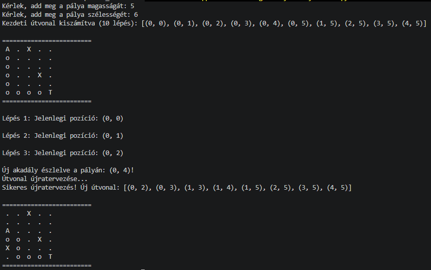

# Road_Planner
## Cél
>Dinamikus útvonaltervező és re-planning szimuláció A* (A-Star) keresőalgoritmussal Pythonban, valós idejű akadályészleléssel és rácsalapú vizualizációval.

## Projekt Áttekintés
A projekt egy önvezető drón / robot dinamikus navigációját szimulálja egy testreszabható méretű 2D-s rácson. A szimuláció főbb funkciói:

- A Útvonaltervezés:* Legrövidebb út megtalálása Manhattan-távolság heurisztikával.
- Dinamikus Akadálykezelés: Mozgás közben véletlenszerűen megjelenő új akadályok szimulációja.
- Valós idejű Újratervezés (Re-planning): Ha az eredeti útvonal blokkolttá válik, a rendszer automatikusan újratervezi az utat a jelenlegi pozícióból a cél felé.
- Konzolos Vizualizáció: Lépésről lépésre követhető navigáció és térképrajzolás.

## Tech Stack

* **Nyelv:** Python
* **Adatstruktúrák:** `heapq` (Min-Heap / Elsőbbségi sor a hatékony A* kereséshez)
* **Modulok:** `time`, `random`

## High-Level Design (HLD)
Az alábbi diagram a rendszer architekturális felépítését és a dinamikus útvonaltervezési ciklust mutatja be:


## Működési Logika és Algoritmus
1. A* Keresőalgoritmus 
Az algoritmus az f(n) = g(n) + h(n) képlet alapján priorizálja a csomópontokat:
g(n): A kezdőponttól megtett tényleges lépések száma.
h(n): Manhattan-távolság heurisztika a célpontig:
heuristic(a, b) = | $a_x$ - $b_x$ | + | $a_y$ - $b_y$ |
2. Térképkezelés 
A GridMap osztály felel a pálya határainak ellenőrzéséért, a statikus és dinamikus akadályok tárolásáért (set adatstruktúrában a O(1) idejű kereséshez), valamint az érvényes szomszédos mezők lekérdezéséért.

## Telepítés és Futtatás

### Előfeltételek
Python 3.x telepítése szükséges (nincs szükség külső könyvtárak telepítésére, csak a beépített modulokat használja).

### 1. Repository klónozása
```bash
git clone https://github.com/vrgdori/Road_Planner.git
cd Road_Planner
```

### 2. A script futtatása
```bash
python main.py
```
### 3. Használat
A program indítás után bekéri a pálya méreteit (magasság és szélesség), majd automatikusan elindítja a szimulációt a (0, 0) kezdőpontból a jobb alsó sarok  felé.

## Mérnöki Döntések és Kihívások
- Rács-koordináták inicializációs hibája 
    - Probléma: A `GridMap` inicializálása felcserélt paraméterekkel történt (`GridMap(grid_height, grid_width)` a várt `width`, `height` helyett), ami nem-négyzetes pályák esetén indexelési hibákat vagy érvénytelen lépéseket okozott.
    - Megoldás: A koordinátarendszer konzisztens kezelése a (x, y) tengelyek mentén.
- Hatékony Akadálykeresés: Az akadályok tárolására lista helyett Python set-et használ a kód, így a mezők érvényességének ellenőrzése (`is_valid`) O(1) időkomplexitással fut O(N) helyett.
- Edge Case Kezelés dinamikus akadályoknál: Ha a megjelenő új akadály közvetlenül a drón előtti mezőt zárja le, a rendszer azonnal megállítja a mozgást, frissíti a térképet, és sikeresen elkerüli az ütközést az útvonal újraszámításával.

## Eredmény

